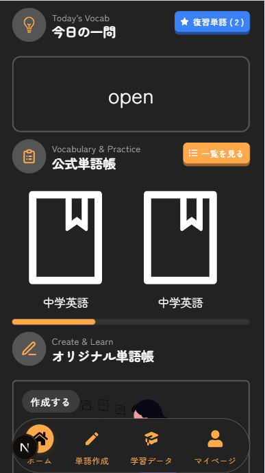
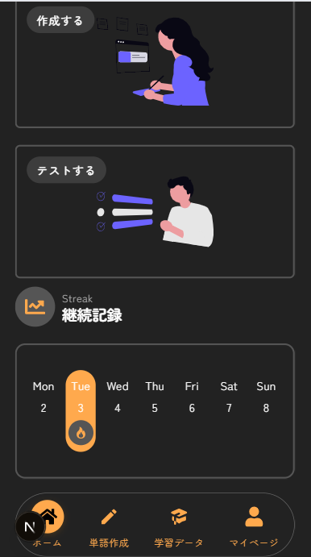
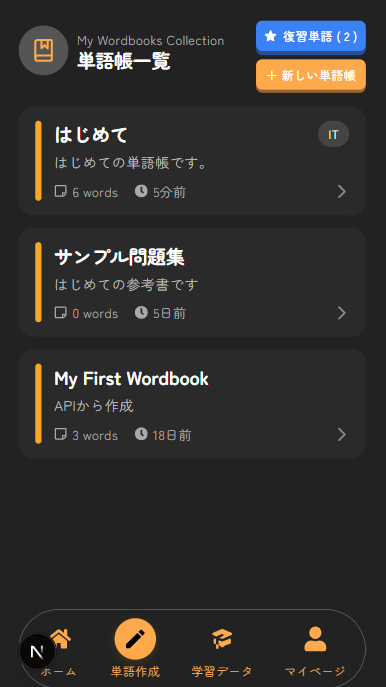
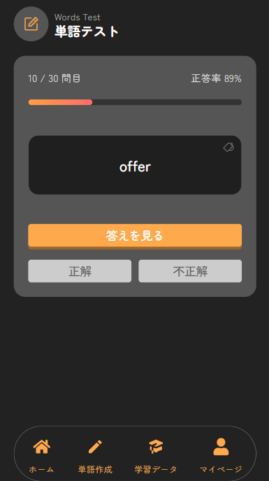
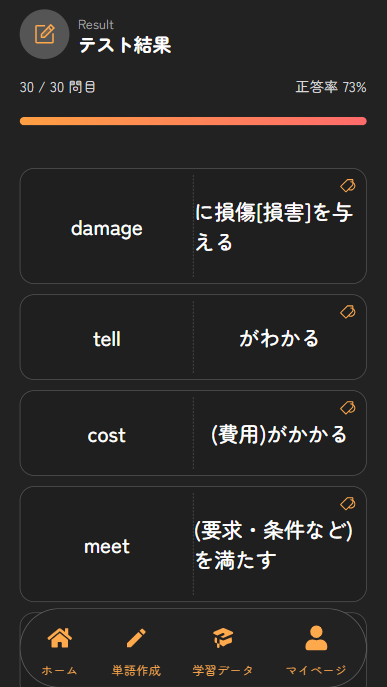
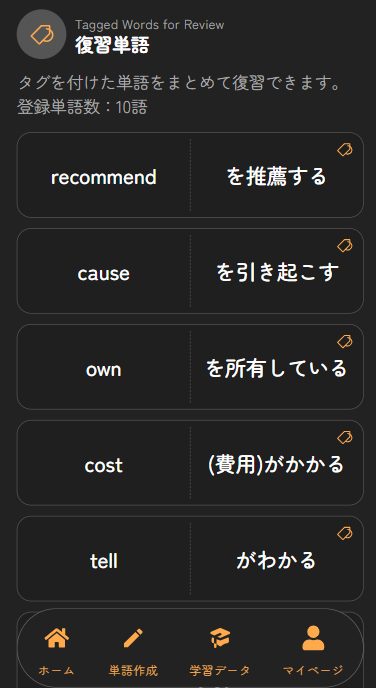
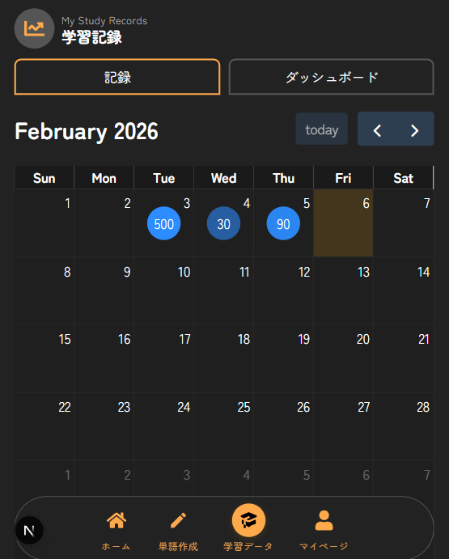
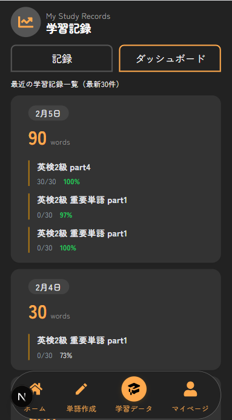
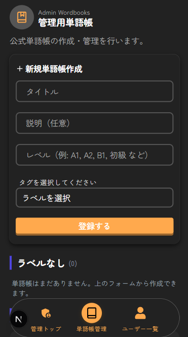
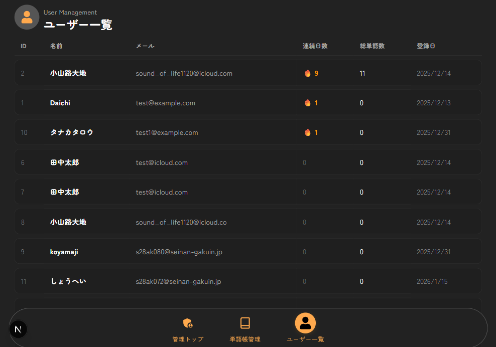

# MemoRise

単語暗記学習の継続を支援するWebアプリです。  
単語帳管理・テスト・学習記録を通じて、
**「学習の習慣化」と「進捗の可視化」**を目的に開発しました。

公式単語帳を用いたテスト機能に加え、自作単語帳の作成・学習にも対応しています。
また、テストで間違えた単語を記録し、復習とその継続を促す仕組みを提供しています。
学習結果が積み上がっていく感覚を得られるよう、記録と可視化を重視した設計としています。

---
## Demo
- https://memorise-opal.vercel.app

※ 動作確認にはユーザー登録が必要です。

## Features

### トップ
- 今日の一問（復習単語等から一問を表示、出会う回数を増やす）
- 公式単語集（既存の単語帳も提供、自作する必要するがないため、すぐに学習を始められる）
- 自作単語帳への導線
- 週ごとのstreakを表示（自分の記録からやる気upを狙う）

### 単語帳管理
- 公式単語帳の閲覧
- 自作単語帳の作成・編集

---

### 単語テスト機能
- 単語帳ごとのテスト実行
- 学習結果の判定（正解 / 不正解）と正答率ゲージの表示
- テスト終了後に間違えた単語リストを出力し、復習単語として登録

---

### 復習支援
- テストで間違えた単語の記録
- 復習対象として再学習を促進

---

### 学習記録・可視化
- 日ごとの学習記録（解いた問題の結果を保存）
- カレンダー形式での学習状況表示

---

### マイページ
- 連続学習日数（streak）の表示
- 登録単語数の表示

---

### 管理者用機能 
- 公式単語帳の作成・管理
- ユーザー一覧の閲覧

## Tech Stack

### フロントエンド
- Next.js (App Router)
- TypeScript
- React Query
- CSS Modules

### バックエンド
- Ruby on Rails (API mode)
- JWT認証
- MySQL（ローカル環境）
- PostgreSQL（本番環境 / Render）

### インフラ・開発環境
- Docker / Docker Compose
- Vercel（フロントエンド）
- Render（バックエンド・DB）

---

## Design & Architecture

### 認証・権限管理の設計
ユーザー用と管理者用で認証を分離し、それぞれ JWT を用いた認証方式を採用しました。
トークンを分けることで、一般ユーザーから管理者機能への不正アクセスを防ぎ、
フロントエンド・バックエンド双方で責務が明確になる設計としています。

### 学習継続を意識したデータ設計
学習記録（StudyRecord）を中心としたデータ設計とし、
日ごとの学習履歴をもとに連続学習日数（streak）やカレンダー表示を実現しています。
単発の学習結果ではなく「継続」を評価できる構造を意識しました。

### テスト〜復習〜記録の学習フロー設計
単語テストの結果から間違えた単語を自動的に抽出し、
復習用の単語として再学習できる流れを設計しました。
テストで終わらず、次の学習につながる体験を重視しています。

### 再利用性を意識したフロントエンド設計
フォームやレイアウトは共通コンポーネントとして切り出し、
画面ごとの差分を最小限に抑えています。
これにより、機能追加やUI修正時の影響範囲を限定できる構成としました。

### 管理者機能
単語帳に関しては、一般ユーザーは表示専用とし、
管理者のみが作成・編集・削除を行えるよう API のルートを分離しています。
ユーザー用 / 管理者用でエンドポイントを明確に分けることで、
権限による操作制限をサーバー側で担保する設計としました。
また、CSV による一括登録機能を実装し、大量の単語を効率的に登録できるようにしました。

## Setup

※ Docker を使用したローカル開発環境を前提としています。
