# MemoRise

単語暗記学習の継続を支援するWebアプリです。  
単語帳管理・テスト・学習記録を通じて、
**「学習の習慣化」と「進捗の可視化」**を目的に開発しました。

公式単語帳を用いたテスト機能に加え、自作単語帳の作成・学習にも対応しています。
また、テストで間違えた単語を記録し、復習とその継続を促す仕組みを提供しています。
学習結果が積み上がっていく感覚を得られるよう、記録と可視化を重視した設計としています。

## 制作背景

### 課題
自分自身が受験生だった頃に「続けたくなる単語帳アプリ」が欲しかった経験と、現在受験生である弟が英単語学習を続けようとする様子を間近で見た経験から、市販の単語帳アプリや紙の単語帳には次のような課題があると感じました。

- **継続が続かない**：単語帳をめくるだけでは達成感を得にくく、学習が習慣化しない。
- **間違えた単語が積み上がらない**：一度間違えても次に出会える保証がなく、苦手が放置されやすい。
- **進捗が見えない**：「自分がどれだけ取り組んできたか」を可視化できないとモチベーションが続かない。

学習が続かない原因は能力ではなく **「続けたくなる仕組みの欠如」** にあると考え、技術で解ける課題だと判断しました。

### 目的
**「学習の習慣化」** と **「進捗の可視化」** を軸に、以下の3点を実現することを目的としました。

1. **間違えた単語を確実に復習につなげる**：テスト結果から間違えた単語を自動で復習リストへ登録し、復習画面で再学習できる導線を整える。
2. **継続のモチベーションを生む**：連続学習日数（streak）と学習カレンダーで「積み上がっている感覚」を提供する。
3. **すぐ始められる**：公式単語帳をプリセットとして用意し、自作の手間なく学習を開始できる状態にする。

機能の取捨選択は一貫して **「自分や弟が、受験生として継続して使えるか」** を判断軸に行い、ユーザー視点での課題解決を最優先しました。

---

## 技術選定およびその意図

> 各項目の太字は採用した技術名、その下のインデントは「補足としてのやさしい説明」です。

### フロントエンド：Next.js (App Router) + TypeScript
- **Next.js (App Router)**：ルーティング・SSR/SSG・API連携が1フレームワークで完結し、Webアプリ開発に必要な要素を一通り揃えられるため採用。App Routerを選んだのは、Server Components等のReact最新トレンドを学習しながら実装する目的も兼ねたため。
  - *SSR/SSG：サーバー側でHTMLを組み立ててから返す描画方式。クライアント側で組み立てる方式に比べ、初回表示が速くSEOにも有利。*
  - *App Router：Next.js 13以降のルーティング方式で、Server Components（サーバー側で実行されるReactコンポーネント）に対応している。*
- **TypeScript**：APIレスポンスやコンポーネントPropsを型で縛ることで、実行時エラー（ランタイムエラー）を未然に防ぎ、リファクタリング時の安心感を担保。

### 状態管理：React Query
- サーバーから取得するデータ（サーバーステート）と画面内だけで使うデータ（クライアントステート）を分離することで、責務を明確化。
- キャッシュ／自動再フェッチ／ローディング・エラーハンドリングを一元化でき、画面ごとに同じ状態管理コードを重複させずに済む。
  - *再フェッチ：一度取得したデータを必要なタイミングで取り直すこと。React Queryは「画面に戻ってきた時」「一定時間経過後」などに自動で再取得してくれる。*

### スタイリング：CSS Modules
- 個人開発スコープでは、CSS-in-JSのランタイムコストよりもシンプルな運用を優先。
  - *CSS-in-JS：JavaScript内にスタイルを書くライブラリ群（styled-components等）。実行時にCSSを生成するためブラウザ側に処理コストがかかる。*
- クラス名が自動的にスコープ分離（ファイル単位で一意な名前に変換）されるため、クラス衝突を意識せずに済み、Next.jsのデフォルト構成と相性が良い。
- 素のCSSに近い記法でwebコーディングの経験を活かせる点も採用理由。

### バックエンド：Ruby on Rails (API mode)
- **規約による開発速度**：Railsは「ファイルの置き場所」「命名ルール」などの規約が決まっており（Convention over Configuration）、設定ファイルを書く量が少なく済む。認証・バリデーション・関連付け等もレールに乗りやすく、個人開発でも機能拡張のスピードを保てる。
- **API mode**：HTMLを返さずJSONだけを返す軽量な構成。フロントは Next.js に分離し、Rails は純粋な API サーバーとして運用。責務の分離が明確になり、実務でよくあるフロント／バックエンド分離構成にも近づけられる。

### 認証：JWT（ユーザー／管理者で分離）
- JWTはトークン自体に必要な情報を含めるため、サーバー側でセッションを保持する必要がない（ステートレス認証）。サーバーを増やしたとき（水平スケール）にもどのサーバーでもトークンを検証できるため有利。

### データベース：MySQL（ローカル）／ PostgreSQL（本番／Render）
- ローカルではこれまでの開発経験から馴染みのあるMySQLを採用し、開発のスピードを優先。
- 本番は、無料枠で安定運用できる Render のマネージドDB（クラウド事業者がバックアップ・運用を代行してくれるDB）に合わせて PostgreSQL を選定。
- Railsの ActiveRecord（DB操作を抽象化するライブラリ）がDB差異を吸収するため、両環境をほぼ同じコードのまま運用できる。

### インフラ：Docker / Vercel / Render
- **Docker / Docker Compose**：フロント・バック・DB をワンコマンドで立ち上げ、環境差分による「自分の環境では動くのに他では動かない」問題を排除。
- **Vercel（フロントエンド）**：Next.js との親和性が最も高く、`git push` で自動的にプレビュー環境（本番反映前に動作確認できるURL）が生成されるため、デプロイの心理的コストをほぼゼロにできる。
- **Render（バックエンド・DB）**：無料枠でWebサービスとマネージドDBを同居運用でき、個人開発の運用コスト・保守負荷を最小化。

---
## Demo
https://memorise-opal.vercel.app

※ 一部機能の確認にはユーザー登録が必要です。

### 管理者アカウント（評価用）

- URL: https://memorise-opal.vercel.app/admin-login  
- Email: sound_of_life1120@icloud.com  
- Password: password1231  

※ 本アカウントはポートフォリオ評価用の一時的なデモアカウントです。

## Features

### トップ
- 今日の一問（復習単語等から一問を表示、出会う回数を増やす）
- 公式単語集（既存の単語帳も提供、自作する必要するがないため、すぐに学習を始められる）
- 自作単語帳への導線
- 週ごとのstreakを表示（自分の記録からやる気upを狙う）

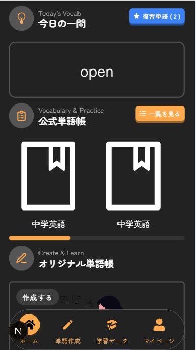
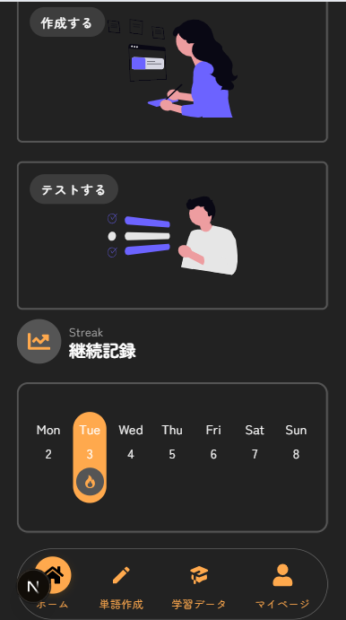

### 単語帳管理
- 公式単語帳の閲覧
- 自作単語帳の作成・編集

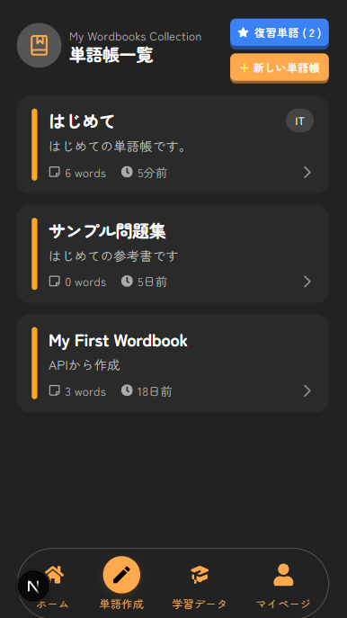
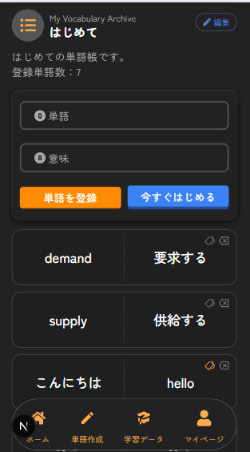

---

### 単語テスト機能
- 単語帳ごとのテスト実行
- 学習結果の判定（正解 / 不正解）と正答率ゲージの表示
- テスト終了後に間違えた単語リストを出力し、復習単語として登録

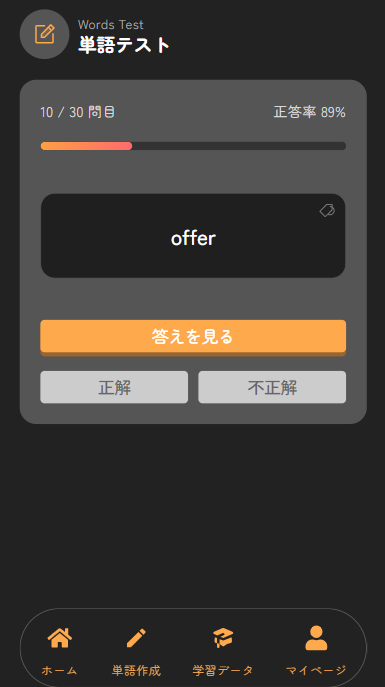
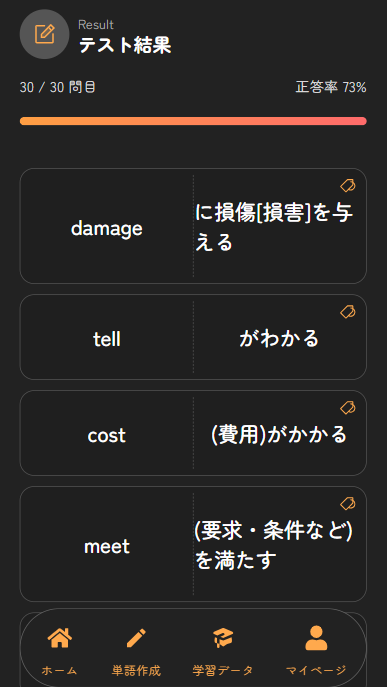

---

### 復習支援
- テストで間違えた単語の記録
- 復習対象として再学習を促進

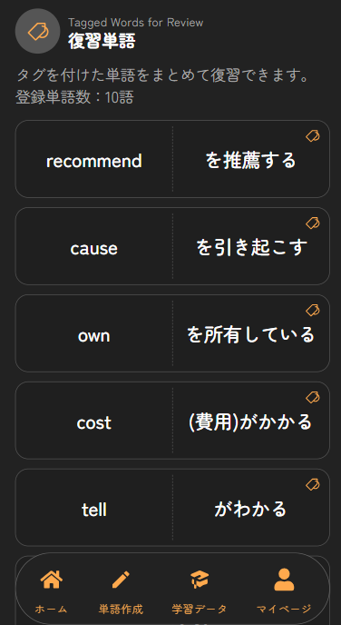

---

### 学習記録・可視化
- 日ごとの学習記録（解いた問題の結果を保存）
- カレンダー形式での学習状況表示

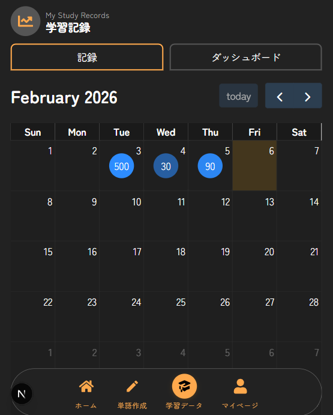
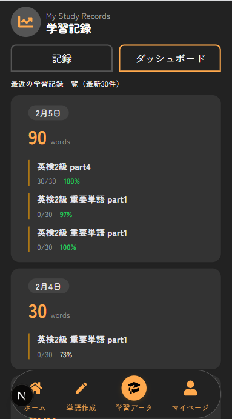

---

### マイページ
- 連続学習日数（streak）の表示
- 登録単語数の表示

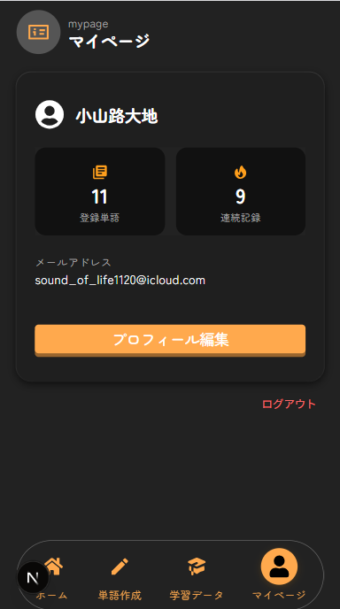

---

### 管理者用機能 
※ 動作確認にはadminアカウントでのログインが必要です。
email : sound_of_life1120@icloud.com
password : password1231
URL : https://memorise-opal.vercel.app/admin-login

- 公式単語帳の作成・管理
- ユーザー一覧の閲覧

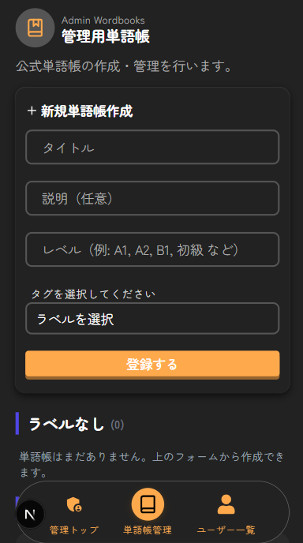
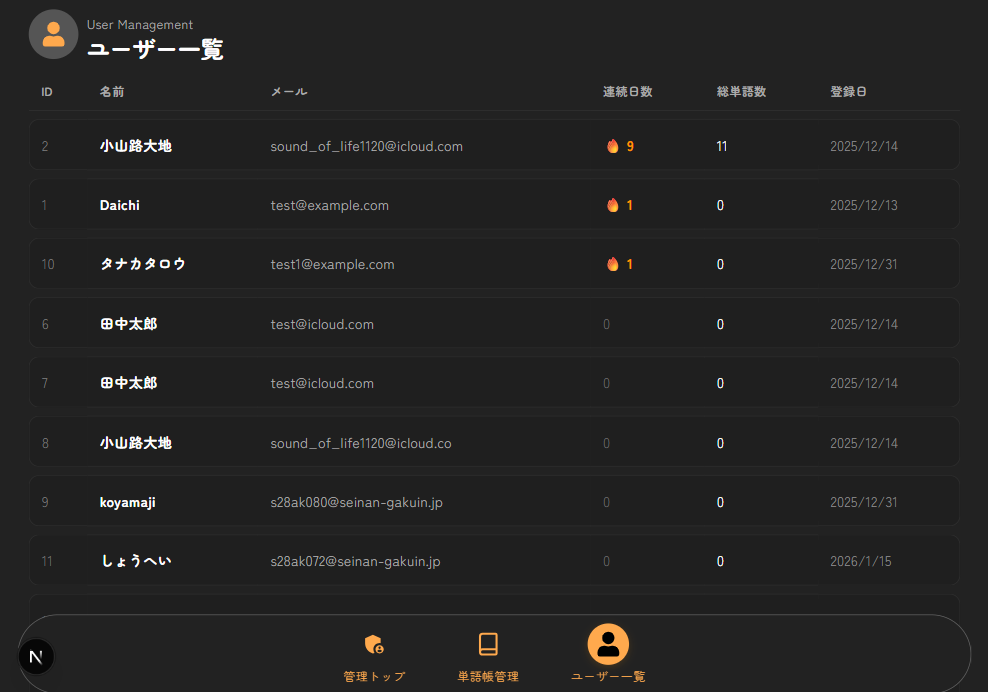

## Tech Stack

### フロントエンド
- Next.js (App Router)
- TypeScript
- React Query
- CSS Modules

### バックエンド
- Ruby on Rails (API mode)
- JWT認証
- MySQL（ローカル環境）
- PostgreSQL（本番環境 / Render）

### インフラ・開発環境
- Docker / Docker Compose
- Vercel（フロントエンド）
- Render（バックエンド・DB）

---

## Design & Architecture

### 認証・権限管理の設計
ユーザー用と管理者用で認証を分離し、それぞれ JWT を用いた認証方式を採用しました。
トークンを分けることで、一般ユーザーから管理者機能への不正アクセスを防ぎ、
フロントエンド・バックエンド双方で責務が明確になる設計としています。

### 学習継続を意識したデータ設計
学習記録（StudyRecord）を中心としたデータ設計とし、
日ごとの学習履歴をもとに連続学習日数（streak）やカレンダー表示を実現しています。
単発の学習結果ではなく「継続」を評価できる構造を意識しました。

### テスト〜復習〜記録の学習フロー設計
単語テストの結果から間違えた単語を自動的に抽出し、
復習用の単語として再学習できる流れを設計しました。
テストで終わらず、次の学習につながる体験を重視しています。

### 再利用性を意識したフロントエンド設計
フォームやレイアウトは共通コンポーネントとして切り出し、
画面ごとの差分を最小限に抑えています。
これにより、機能追加やUI修正時の影響範囲を限定できる構成としました。

### 管理者機能
単語帳に関しては、一般ユーザーは表示専用とし、
管理者のみが作成・編集・削除を行えるよう API のルートを分離しています。
ユーザー用 / 管理者用でエンドポイントを明確に分けることで、
権限による操作制限をサーバー側で担保する設計としました。
また、CSV による一括登録機能を実装し、大量の単語を効率的に登録できるようにしました。

## Setup

※ Docker を使用したローカル開発環境を前提としています。
